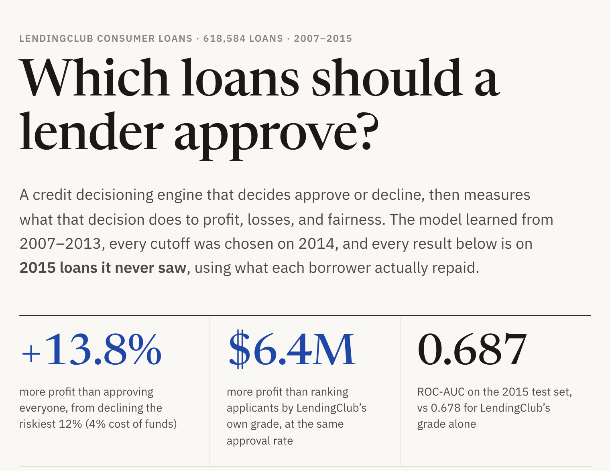
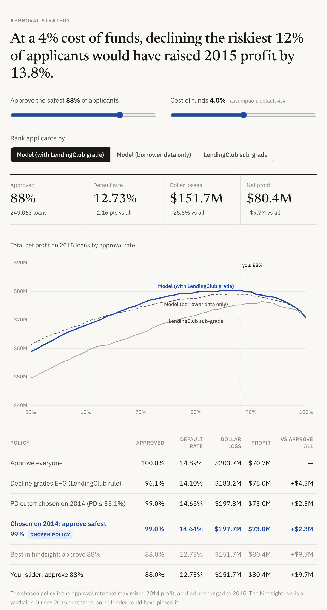
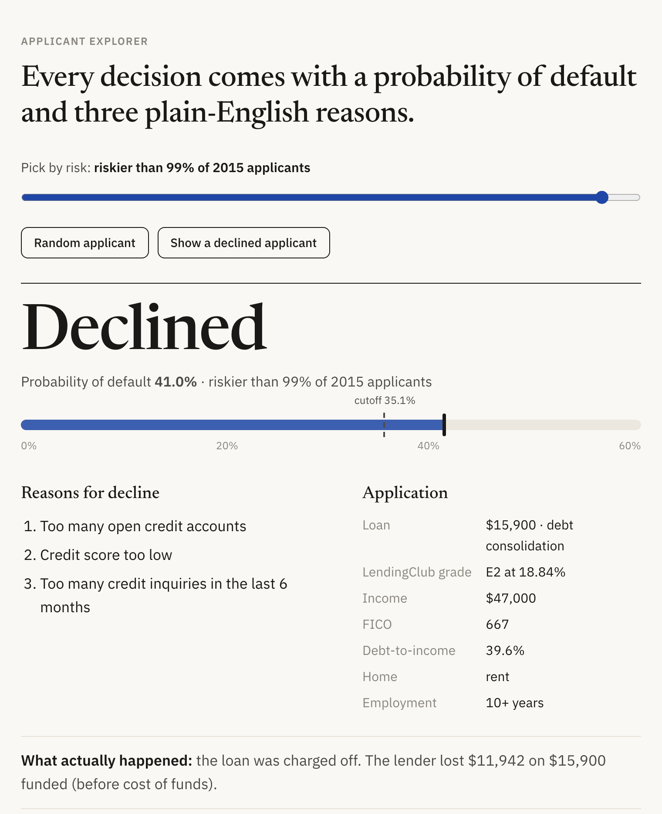
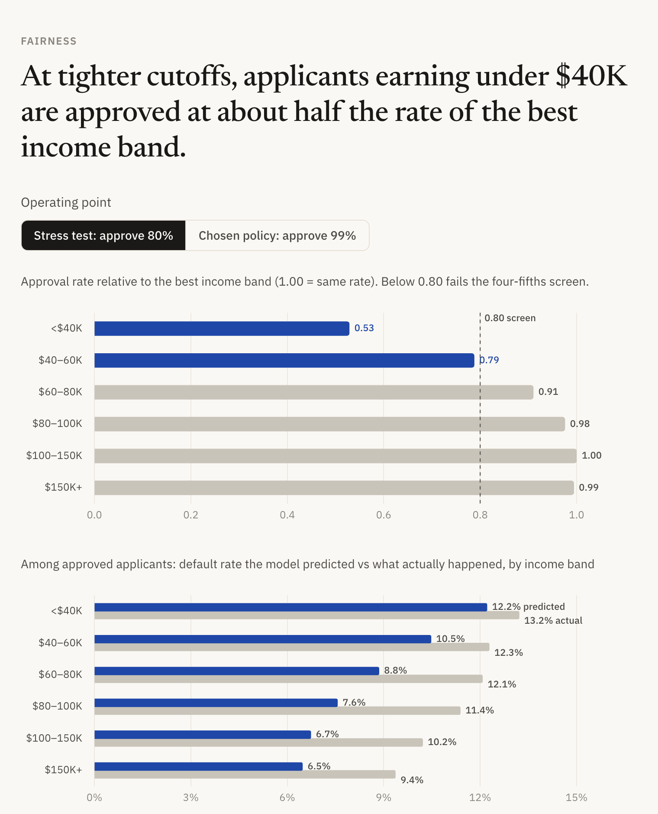

# Credit Decisioning Engine

Which loans should a lender approve? An approve/decline engine on 618,584 LendingClub loans, measured in
profit, losses, and fairness.

**Live site: [credit-decisioning-engine-zeta.vercel.app](https://credit-decisioning-engine-zeta.vercel.app)**



## About

A personal portfolio project to build hands-on expertise in consumer credit risk and lending analytics, using
public LendingClub loan data. Models are trained on 2007–2013 loans, every cutoff is chosen on 2014, and all
results are reported on 2015 loans the models never saw.

## Key findings

- **Cost of capital decides the policy.** With no funding cost, approving almost everyone is optimal
  (+0.3%), because LendingClub's rates already price the risk. At a 4% cost of funds, declining the riskiest
  12% raises 2015 profit by **13.8%**.
- **The model adds value on top of LendingClub's grade.** Ranking applicants by the model instead of
  LendingClub's sub-grade earns **$6.4M** more at 84% approval (ROC-AUC 0.687 vs 0.678).
- **Cutoffs need re-tuning when pricing moves.** A cutoff chosen on 2014 captured only **+3.3%** in 2015:
  LendingClub cut grade B rates from 11.2% to 10.0% while defaults rose. Interest-rate drift (PSI 0.22) was
  visible from application data alone.
- **Survivorship bias is large.** 88% of 2018's 36-month loans were still running when the data ends, so
  only fully matured 2007–2015 loans are used.
- **Income is the fairness pressure point.** At an 80% approval stress test, applicants under $40K are
  approved at 0.53× the best income band's rate, and the model overstates their risk gap (4.7 points predicted
  vs 1.8 actual).

## Screenshots

**Approval strategy:** move the approval-rate and cost-of-funds sliders and see profit, losses, and the policy table update on 2015 loans.



**Applicant explorer:** each decision comes with a probability of default, three plain-English reasons, and what actually happened.



**Fairness and monitoring:** approval rates and predicted vs actual default by income band, plus population-stability drift checks.



## Approach

- **Time-based validation:** train 2007–2013, tune on 2014, report once on 2015.
- **Leakage and survivorship checks:** application-time inputs only (enforced by tests); `installment` was
  found to encode LendingClub's interest rate and removed from the borrower-only model; only matured vintages
  are used.
- **Profit-based approval strategy:** every cutoff is scored with each loan's actual repayments, with an
  optional cost of funds. Compared against "approve everyone" and a grade-based rule.
- **Decline reasons:** the top 3 per applicant from SHAP values, in plain English; LendingClub's own grade and
  rate are never used as reasons.
- **Fairness and drift checks:** approval and default rates by income, home ownership and state (four-fifths
  screen), and population stability index (PSI) on the score and inputs.

## Tech stack

Python, DuckDB SQL, pandas, scikit-learn, XGBoost, pytest; static site in HTML/CSS/JavaScript with Chart.js,
hosted on Vercel.

## How to run

```bash
python -m venv .venv && source .venv/bin/activate    # Python 3.13
pip install -r requirements.txt

# Put accepted_2007_to_2018Q4.csv.gz (see Data) in data/raw/, then run the full pipeline (~40 min):
./run_pipeline.sh

# Regenerate only the site data from existing results
python -m src.export_site_data

# Run the tests (split, leakage, profit formula, site data vs analysis)
python -m pytest -q

# View the site locally
cd site && python -m http.server 8000
```

## Data

[LendingClub loan data (2007–2018Q4) on Kaggle](https://www.kaggle.com/datasets/wordsforthewise/lending-club).
The raw data is not included in this repository.

## Limitations

- Only loans LendingClub accepted: there are no outcomes for rejected applicants, so the analysis can tighten
  the lending policy but not loosen it.
- Profit excludes servicing and acquisition costs; the cost of funds is an assumption (default 4%).
- The model under-predicts 2015 risk (11.9% predicted vs 14.9% actual), so decisions rely on its ranking and
  actual dollar outcomes rather than its probabilities.
- The data has no protected attributes, so the fairness check is a first screen, not a fair-lending review.
